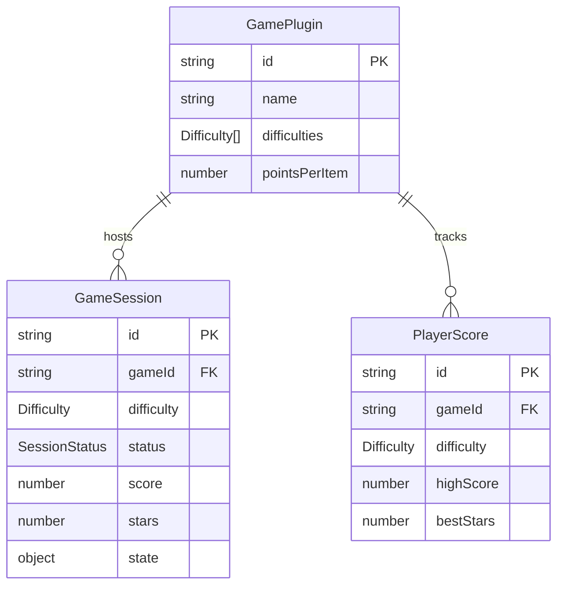

# Data Model: Educational Games PWA

**Feature**: 001-educational-games-pwa
**Date**: 2026-05-31
**Storage**: IndexedDB (client-side only)

## Entities

### GamePlugin (Runtime — not persisted)

Represents a registered game module in the application.

| Field | Type | Description |
|-------|------|-------------|
| id | string | Unique identifier (e.g., "word-search", "crossword", "emoji-guess") |
| name | string | Display name in PT-BR (e.g., "Caça-Palavras") |
| description | string | Brief description for the catalog card |
| icon | ReactComponent | Visual icon/illustration for the home screen |
| component | LazyComponent | Lazy-loaded game component |
| defaultRoundSize | number | Default items per round (5-8) |
| difficulties | Difficulty[] | Available difficulty levels |
| pointsPerItem | number | Fixed points awarded per correct item |

---

### Difficulty (Enum)

| Value | Label (PT-BR) | Visual | Word Length Range |
|-------|---------------|--------|-------------------|
| EASY | Fácil | ★ | 3-5 letters |
| MEDIUM | Médio | ★★ | 4-7 letters |
| HARD | Difícil | ★★★ | 6-10 letters |

---

### GameSession (Persisted — IndexedDB: `sessions` store)

Represents an in-progress or completed game session.

| Field | Type | Description |
|-------|------|-------------|
| id | string (UUID) | Unique session identifier |
| gameId | string | Reference to GamePlugin.id |
| difficulty | Difficulty | Selected difficulty level |
| status | SessionStatus | "in-progress" / "completed" / "abandoned" |
| startedAt | Date | When the session began |
| completedAt | Date? | When the session ended (null if in-progress) |
| score | number | Current score (acertos × pointsPerItem) |
| totalItems | number | Total items in this round |
| correctItems | number | Number of items answered correctly |
| stars | number (0-3) | Star rating (0 if <50%, 1 if ≥50%, 2 if ≥75%, 3 if 100%) |
| state | object | Game-specific state for resume (serialized) |

**Indexes**: `[gameId, difficulty]`, `[gameId, status]`

**State transitions**:
```
→ in-progress → completed
                → abandoned (via back button or app close without completion)
```

---

### PlayerScore (Persisted — IndexedDB: `scores` store)

Aggregate score record per game per difficulty.

| Field | Type | Description |
|-------|------|-------------|
| id | string | Composite key: `{gameId}_{difficulty}` |
| gameId | string | Reference to GamePlugin.id |
| difficulty | Difficulty | Difficulty level |
| highScore | number | Best score achieved |
| bestStars | number (0-3) | Best star rating achieved |
| totalGamesPlayed | number | Count of completed sessions |
| lastPlayedAt | Date | Timestamp of last completed session |

**Indexes**: `[gameId]`

---

### WordEntry (Static data — bundled JSON)

Used by Caça-Palavras and Cruzadinha.

| Field | Type | Description |
|-------|------|-------------|
| word | string | The word (PT-BR, lowercase, with accents) |
| difficulty | Difficulty | Categorization by length/frequency |

**File format**: `words-{difficulty}.json` → `string[]`

---

### CrosswordClue (Static data — bundled JSON)

Used by Cruzadinha.

| Field | Type | Description |
|-------|------|-------------|
| word | string | The answer word (PT-BR) |
| clue | string | Child-friendly clue in simple language |
| difficulty | Difficulty | Categorization |

**File format**: `clues-{difficulty}.json` → `{ word: string, clue: string }[]`

---

### EmojiEntry (Static data — bundled JSON)

Used by Adivinhe o Emoji.

| Field | Type | Description |
|-------|------|-------------|
| emoji | string | The emoji character (Unicode) |
| words | string[] | Accepted answer words (including synonyms) |
| difficulty | Difficulty | Categorization |

**File format**: `emoji-dictionary.json` → `{ emoji: string, words: string[], difficulty: Difficulty }[]`

---

## Relationships



## Validation Rules

1. **GameSession.score**: Must equal `correctItems × GamePlugin.pointsPerItem`. Computed, not user-editable.
2. **GameSession.stars**: Computed from `correctItems / totalItems` ratio:
   - 0 stars: < 50%
   - 1 star: ≥ 50%
   - 2 stars: ≥ 75%
   - 3 stars: = 100%
3. **PlayerScore.highScore**: Updated only when `GameSession.score > PlayerScore.highScore`.
4. **PlayerScore.bestStars**: Updated only when `GameSession.stars > PlayerScore.bestStars`.
5. **EmojiEntry.words**: All words are stored lowercase, without accents, for comparison. Original accented forms kept for display.
6. **Text comparison**: All user input normalized via NFD decomposition + diacritics strip + toLowerCase before comparison.
7. **WordEntry.word**: Must contain only Portuguese alphabetic characters (a-z, with accents). Length 3-10 characters.
8. **GameSession.state**: Opaque to the storage layer — each game defines its own serializable state schema.
