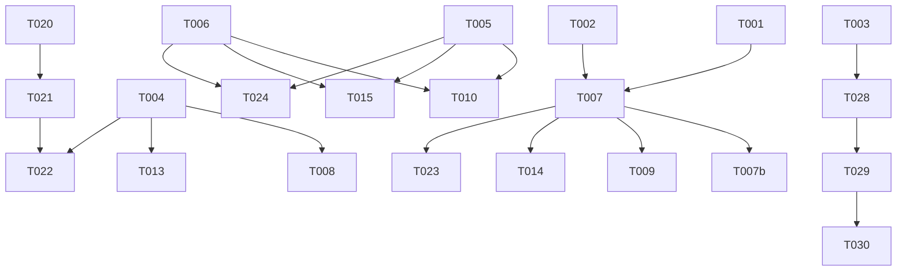

# Tasks: Game Hints & Word Highlights

**Input**: Design documents from `/specs/002-game-hints-highlights/`

**Prerequisites**: plan.md ✅, spec.md ✅, research.md ✅, data-model.md ✅, contracts/ ✅

## Format: `[ID] [P?] [Story?] Description`

- **[P]**: Can run in parallel (different files, no dependencies)
- **[Story]**: Which user story this task belongs to (e.g., US1, US2, US3)
- Include exact file paths in descriptions

---

## Phase 1: Setup (Shared Infrastructure)

**Purpose**: Extend core systems to support hints — scoring engine, types, design tokens

- [x] T001 Add `calculateScoreWithHints(correctItems, pointsPerItem, hintCount, hintPenalty?)` function to `src/core/scoring/scoring-engine.ts`
- [x] T002 [P] Extend `RoundResults` interface with optional `hintCount` field in `src/core/registry/types.ts`
- [x] T003 [P] Add `wordHighlightColors` palette (10 pastel colors) to `src/design-system/tokens/index.ts`

---

## Phase 2: Foundational (Blocking Prerequisites)

**Purpose**: Shared hook and UI components used by ALL game hint implementations

**⚠️ CRITICAL**: No game-specific hint work can begin until this phase is complete

- [x] T004 Create `useHint` hook in `src/core/hooks/use-hint.ts` implementing UseHintOptions/UseHintReturn contract (hintCount, triggerHint, showPenalty, isHintDisabled). Must handle rapid successive calls (each increments independently, toast re-triggers).
- [x] T005 [P] Create `HintButton` component in `src/design-system/components/HintButton.tsx` (💡 icon + "Dica" label, disabled state, 44x44px touch target)
- [x] T006 [P] Create `HintPenaltyToast` component in `src/design-system/components/HintPenaltyToast.tsx` (framer-motion AnimatePresence, slide-down/fade, 2.5s auto-dismiss, "-5 pontos" text)
- [x] T007 Update `useGameSession` hook in `src/core/hooks/use-game-session.ts` to use `calculateScoreWithHints` with `results.hintCount` in `handleRoundComplete`
- [x] T007b Update `completeSession` in `src/core/storage/session-store.ts` to persist `hintCount` field to IndexedDB alongside existing session data

**Checkpoint**: Foundation ready — shared hint infrastructure complete. Game-specific integration can begin.

---

## Phase 3: User Story 1 — Hint in Word Search (Priority: P1) 🎯 MVP

**Goal**: Player can tap hint button to highlight first letter of an unfound word, with -5 penalty and toast feedback

**Independent Test**: Start Word Search → tap "Dica" → verify a cell pulses with accent border corresponding to an unfound word's first letter; score reflects -5

### Implementation for User Story 1

- [x] T008 [US1] Add `hintedWordCells` state (Map<string, CellCoord>) and `onHint` callback to `src/games/word-search/WordSearchGame.tsx` — selects random unfound/unhinted word, stores first cell
- [x] T009 [US1] Integrate `useHint` hook in `src/games/word-search/WordSearchGame.tsx` — wire onHint callback, pass hintCount to onRoundComplete
- [x] T010 [US1] Render `HintButton` and `HintPenaltyToast` in `src/games/word-search/WordSearchGame.tsx` — position hint button at top-right near score area
- [x] T011 [US1] Add hint cell highlight rendering in `src/games/word-search/WordSearchGame.tsx` — pulsing border animation using `colors.accent` for hinted cells; clear highlight when word is found
- [x] T012 [US1] Disable hint button when all words are found or all unfound words already hinted in `src/games/word-search/WordSearchGame.tsx`

**Checkpoint**: Word Search hint fully functional and independently testable

---

## Phase 4: User Story 3 — Hint in Emoji Guess (Priority: P1)

**Goal**: Player can tap hint button to append next correct letter sequentially, with -5 penalty and toast feedback

**Independent Test**: Start Emoji Guess → tap "Dica" → verify next correct letter appears in input with hint styling (purple italic); locked from backspace

### Implementation for User Story 3

- [x] T013 [US3] Add `lockedPositions` state (Set<number>) and `onHint` callback to `src/games/emoji-guess/EmojiGuessGame.tsx` — gets correct answer, appends letter at input.length, adds to locked set
- [x] T014 [US3] Integrate `useHint` hook in `src/games/emoji-guess/EmojiGuessGame.tsx` — wire onHint callback, pass hintCount to onRoundComplete
- [x] T015 [US3] Render `HintButton` and `HintPenaltyToast` in `src/games/emoji-guess/EmojiGuessGame.tsx` — position at top-right
- [x] T016 [US3] Update `src/games/emoji-guess/components/AnswerInput.tsx` to render locked hint letters with distinct styling (color: `colors.primary`, fontStyle: italic) and non-locked letters normally
- [x] T017 [US3] Update `onBackspace` in `src/games/emoji-guess/EmojiGuessGame.tsx` to skip locked positions (cannot delete hint-revealed letters)
- [x] T018 [US3] Disable hint button when `input.length >= answer.length` in `src/games/emoji-guess/EmojiGuessGame.tsx`
- [x] T019 [US3] Preserve locked positions and hint letters across incorrect answer attempts (reset only on next emoji round) in `src/games/emoji-guess/EmojiGuessGame.tsx`

**Checkpoint**: Emoji Guess hint fully functional and independently testable

---

## Phase 5: User Story 2 — Hint in Crossword (Priority: P1)

**Goal**: Player can select a cell and tap hint to reveal the correct letter (locked, purple italic), with -5 penalty and toast feedback

**Independent Test**: Start Crossword → select empty cell → tap "Dica" → verify correct letter appears with hint styling; cell is non-editable; word completion still triggers

### Implementation for User Story 2

- [x] T020 [US2] Change `filledLetters` state from `Map<string, string>` to `Map<string, { letter: string; isHint: boolean }>` in `src/games/crossword/CrosswordGame.tsx`
- [x] T021 [US2] Update all existing `filledLetters` read/write operations to use new `{ letter, isHint }` structure in `src/games/crossword/CrosswordGame.tsx`
- [x] T022 [US2] Add `onHint` callback to `src/games/crossword/CrosswordGame.tsx` — checks selected cell, validates not already correct, sets letter with isHint:true, advances cursor
- [x] T023 [US2] Integrate `useHint` hook in `src/games/crossword/CrosswordGame.tsx` — wire onHint, handle "no cell selected" and "already correct" edge cases, pass hintCount to onRoundComplete
- [x] T024 [US2] Render `HintButton` and `HintPenaltyToast` in `src/games/crossword/CrosswordGame.tsx` — position at top-right
- [x] T025 [US2] Update `src/games/crossword/components/CrosswordGrid.tsx` to render hint letters with distinct styling (color: `colors.primary`, fontStyle: italic)
- [x] T026 [US2] Update keyboard/backspace handling in `src/games/crossword/CrosswordGame.tsx` to skip hint-revealed cells (locked, non-editable)
- [x] T027 [US2] Ensure `checkWordCompletion` treats hint letters same as player letters for word completion in `src/games/crossword/CrosswordGame.tsx`

**Checkpoint**: Crossword hint fully functional and independently testable

---

## Phase 6: User Story 4 — Crossword Word Color Coding (Priority: P2)

**Goal**: Each completed word in Crossword is highlighted with a unique pastel background color; intersections show most recently completed word's color

**Independent Test**: Complete multiple words in Crossword → verify each word's cells have different background colors; intersection cells show latest word's color

### Implementation for User Story 4

- [x] T028 [US4] Change `completedWords` state from `Set<string>` to `Map<string, { colorIndex: number; completedOrder: number }>` in `src/games/crossword/CrosswordGame.tsx`
- [x] T029 [US4] Update `checkWordCompletion` to assign `colorIndex` (cycling through `wordHighlightColors`) and `completedOrder` when word completes in `src/games/crossword/CrosswordGame.tsx`
- [x] T030 [US4] Update `src/games/crossword/components/CrosswordGrid.tsx` to compute cell background color — for each cell, find all completed words containing it, pick the one with highest `completedOrder`, apply corresponding `wordHighlightColors[colorIndex]`
- [x] T031 [US4] Ensure text remains readable on colored backgrounds (use `colors.textPrimary` which has WCAG AA contrast with all palette colors) in `src/games/crossword/components/CrosswordGrid.tsx`

**Checkpoint**: Crossword word color coding fully functional and independently testable

---

## Phase 7: User Story 5 — Hint Penalty Feedback (Priority: P1)

**Goal**: Consistent, visible penalty feedback across all games — toast animation + score emphasis

**Independent Test**: Use hint in any game → verify "-5 pontos (dica usada)" toast appears for ~2.5s with slide-down animation; score display flashes briefly

*Note: Most of US5 is already delivered by T005, T006, T010, T015, T024. This phase handles the score emphasis animation.*

### Implementation for User Story 5

- [x] T032 [US5] Add score penalty animation in `src/pages/GameShell.tsx` — brief color flash (red) on score display when hint is used (coordinate via session score change detection or prop)

**Checkpoint**: Hint penalty feedback fully polished across all games

---

## Phase 8: Polish & Cross-Cutting Concerns

**Purpose**: Final integration, edge cases, and cleanup

- [ ] T033 Verify rapid successive hints work correctly — each hint processes individually with separate -5 and toast queue in all three games
- [ ] T034 [P] Verify Word Search hint button disables when only one unfound word remains and already hinted
- [ ] T035 [P] Verify Crossword hint-revealed letters count toward intersecting word completion
- [ ] T036 [P] Verify Emoji Guess hint letters persist across incorrect answer submission within same round
- [ ] T037 Run `npm run lint` and fix any lint warnings/errors introduced by new code
- [ ] T038 Run `npm run build` and verify zero TypeScript compilation errors

---

## Dependencies

## Parallel Execution Opportunities

| Parallel Group | Tasks | Why Parallel |
|---------------|-------|--------------|
| Setup tokens + types | T002, T003 | Different files, no deps on each other |
| DS components | T005, T006 | Independent component files |
| US1 + US3 after Phase 2 | T008-T012, T013-T019 | Different game modules, no shared state |
| US2 after Phase 2 | T020-T027 | Can overlap with US1/US3 after T004-T007 complete |
| US4 after US2 | T028-T031 | Same file as US2 but builds on completed crossword work |
| Polish verifications | T034, T035, T036 | Independent edge case checks |

## Implementation Strategy

- **MVP Scope**: Phase 1 + Phase 2 + Phase 3 (Word Search hint only) — delivers core hint UX in simplest game
- **Incremental Delivery**: Each Phase 3-6 is independently deployable and testable
- **Highest Risk**: Phase 5 (Crossword hint) — requires state shape change (`filledLetters` Map value type); recommend implementing after Word Search to validate the pattern
- **Phase 6 (Color Coding)** depends on Phase 5 state changes being complete (shares `completedWords` state in same component)
